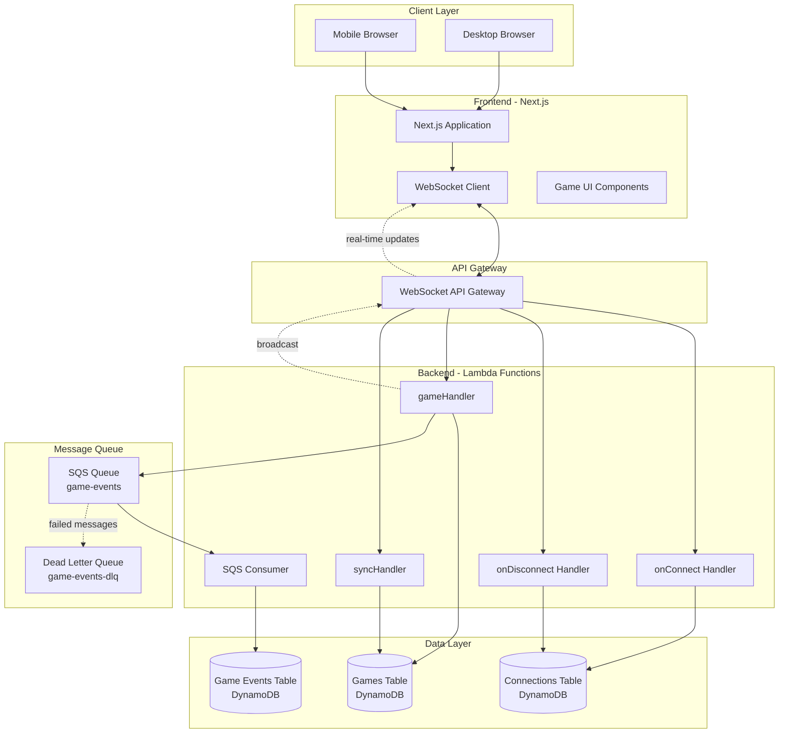
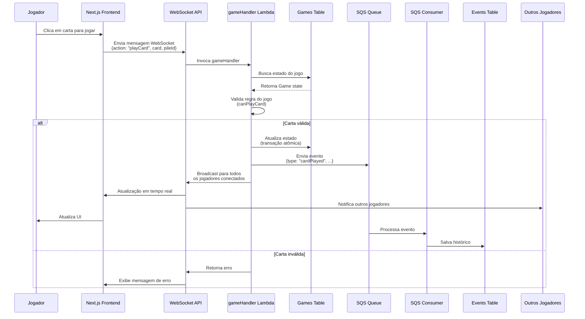
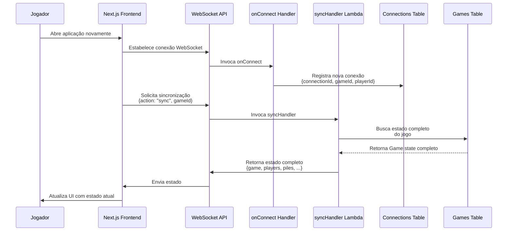
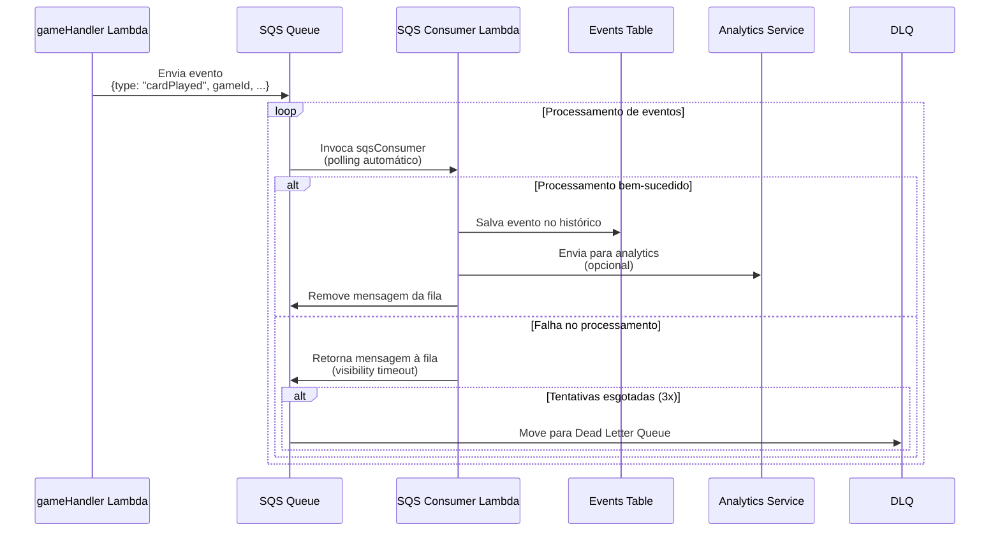
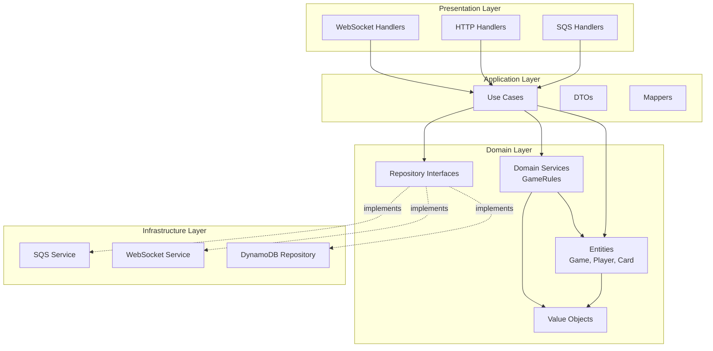
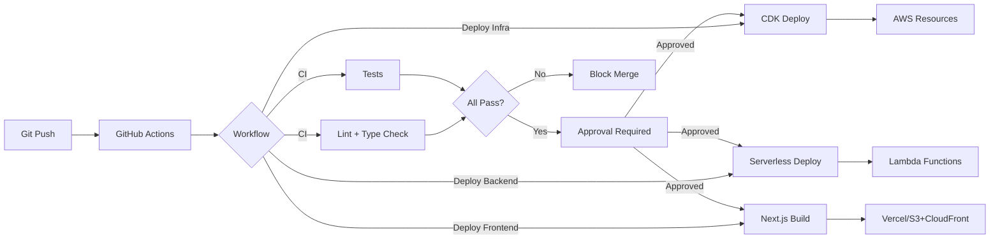

# Arquitetura do Sistema - The Game

Este documento descreve a arquitetura completa do sistema de jogo cooperativo online "The Game".

## Visão Geral

O sistema é composto por três camadas principais:
- **Frontend**: Next.js (React) - Interface do usuário responsiva
- **Backend**: AWS Lambda + API Gateway WebSocket - Lógica de negócio e comunicação em tempo real
- **Infraestrutura**: AWS (DynamoDB, SQS, CloudFormation/CDK) - Persistência e processamento assíncrono

## Diagrama de Arquitetura Geral



## Componentes Principais

### Frontend (Next.js)

**Páginas:**
- `/` - Lobby: Listar e criar partidas
- `/game/[gameId]` - Tela do jogo: Visualização e interação

**Componentes:**
- `GameBoard` - Visualização das 4 pilhas (2 crescentes, 2 decrescentes)
- `PlayerHand` - Cartas do jogador atual
- `PlayersList` - Lista de jogadores conectados
- `GameStatus` - Status da partida (turno, cartas restantes)

**Serviços:**
- `WebSocketService` - Gerenciamento de conexão WebSocket
- `GameService` - Lógica de negócio do frontend

### Backend (AWS Lambda)

**Handlers WebSocket:**
- `onConnect` - Registra nova conexão WebSocket
- `onDisconnect` - Limpa conexão ao desconectar
- `gameHandler` - Processa ações do jogo (jogar carta, criar partida, etc)

**Handlers HTTP:**
- `syncHandler` - Sincroniza estado quando jogador reconecta

**Handlers SQS:**
- `sqsConsumer` - Processa eventos da fila SQS

### Infraestrutura AWS

**DynamoDB Tables:**
- `the-game-games` - Estado completo das partidas
- `the-game-connections` - Mapeamento connectionId → gameId + playerId
- `the-game-game-events` - Histórico de eventos (opcional, para replay/debug)

**SQS Queues:**
- `the-game-game-events` - Fila principal para eventos críticos
- `the-game-game-events-dlq` - Dead Letter Queue para eventos que falharam

**API Gateway:**
- WebSocket API para comunicação em tempo real

## Fluxo de Dados

### 1. Jogador Joga uma Carta



### 2. Jogador Reconecta



### 3. Processamento Assíncrono (SQS)



## Arquitetura de Camadas (Clean Architecture)



## Modelo de Dados DynamoDB

### Tabela: `the-game-games`

**Partition Key:** `gameId` (String)

**Atributos:**
```typescript
{
  gameId: string;
  players: Player[];           // Array de jogadores
  piles: {                     // 4 pilhas do jogo
    ascending1: Card[];
    ascending2: Card[];
    descending1: Card[];
    descending2: Card[];
  };
  deck: Card[];                // Baralho restante
  discardPile: Card[];         // Cartas descartadas
  currentTurn: string;         // playerId do jogador atual
  status: 'waiting' | 'playing' | 'finished';
  winner: 'players' | 'game' | null;
  createdAt: number;           // Timestamp
  updatedAt: number;           // Timestamp
  ttl: number;                 // Time to Live (auto-delete após X dias)
}
```

### Tabela: `the-game-connections`

**Partition Key:** `connectionId` (String)

**Atributos:**
```typescript
{
  connectionId: string;        // WebSocket connection ID
  gameId: string;             // ID da partida
  playerId: string;           // ID do jogador
  connectedAt: number;        // Timestamp
  lastActivity: number;       // Timestamp da última atividade
}
```

### Tabela: `the-game-game-events`

**Partition Key:** `gameId` (String)  
**Sort Key:** `timestamp` (Number)

**Atributos:**
```typescript
{
  gameId: string;
  timestamp: number;           // Timestamp do evento
  eventType: 'cardPlayed' | 'gameCreated' | 'gameFinished' | ...;
  eventData: {
    playerId: string;
    card: Card;
    pileId: string;
    // ... outros dados específicos do evento
  };
}
```

## Segurança

### Autenticação e Autorização

- **OIDC com IAM Roles**: GitHub Actions usa OIDC para autenticação segura na AWS
- **Validação de Ações**: Cada ação do jogador é validada (não pode jogar carta do outro)
- **Rate Limiting**: Proteção contra abuso nas Lambdas
- **CORS**: Configurado no API Gateway

### Gestão de Secrets

- **GitHub Secrets**: Credenciais AWS (Role ARN, Region)
- **AWS Secrets Manager**: Secrets da aplicação (se necessário)
- **Nunca commitadas**: Todos os secrets ficam em variáveis de ambiente

## CI/CD Pipeline



## Escalabilidade

### Horizontal Scaling

- **Lambda**: Escala automaticamente baseado em requisições
- **DynamoDB**: On-demand billing, escala automaticamente
- **SQS**: Processa mensagens em paralelo
- **API Gateway WebSocket**: Gerencia milhares de conexões simultâneas

### Limites e Considerações

- **WebSocket Connections**: Até 100.000 conexões simultâneas por API Gateway
- **Lambda Concurrency**: Configurável por função
- **DynamoDB Throughput**: On-demand mode sem limites de throughput
- **SQS Throughput**: Até 3.000 mensagens/segundo por fila

## Monitoramento e Observabilidade

### Métricas AWS CloudWatch

- **Lambda**: Invocações, erros, duração, throttles
- **DynamoDB**: Read/Write capacity, throttles, latência
- **SQS**: Mensagens enviadas/recebidas, mensagens na DLQ
- **API Gateway**: Contagem de conexões, mensagens, latência

### Logs

- **Lambda Logs**: CloudWatch Logs para cada função
- **Application Logs**: Estruturados em JSON para fácil parsing
- **Error Tracking**: Integração com CloudWatch Alarms

## Próximos Passos

1. ✅ Infraestrutura AWS criada (DynamoDB, SQS, WebSocket API)
2. ⏳ Implementar handlers Lambda (onConnect, onDisconnect, gameHandler)
3. ⏳ Implementar lógica de negócio (GameRules, GameService)
4. ⏳ Implementar frontend (componentes React, WebSocket client)
5. ⏳ Implementar testes (TDD para regras de negócio)
6. ⏳ Configurar monitoramento e alertas

## Referências

- [AWS API Gateway WebSocket](https://docs.aws.amazon.com/apigateway/latest/developerguide/apigateway-websocket-api.html)
- [AWS Lambda](https://docs.aws.amazon.com/lambda/)
- [AWS DynamoDB](https://docs.aws.amazon.com/dynamodb/)
- [AWS SQS](https://docs.aws.amazon.com/sqs/)
- [Next.js](https://nextjs.org/docs)
- [Clean Architecture](https://blog.cleancoder.com/uncle-bob/2012/08/13/the-clean-architecture.html)

