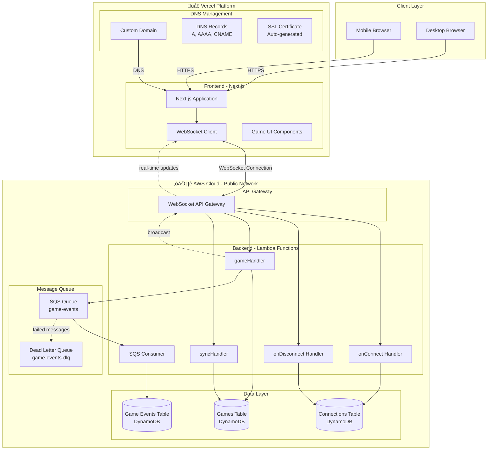
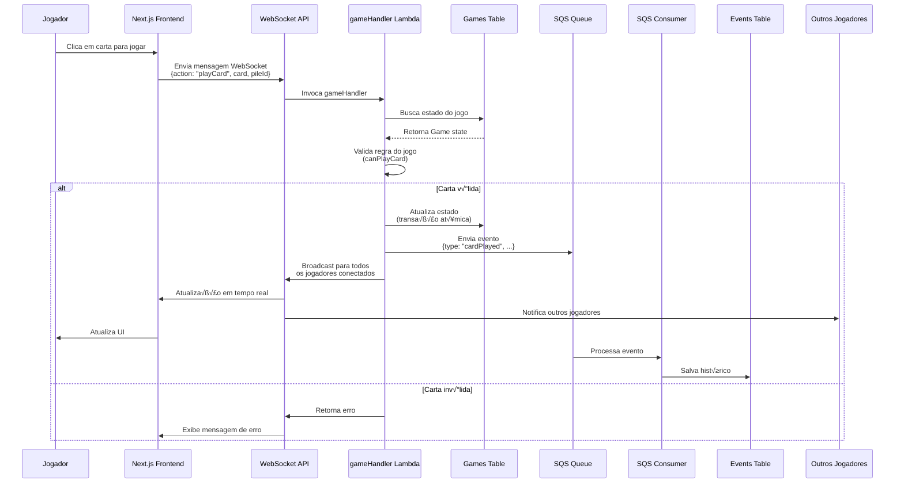
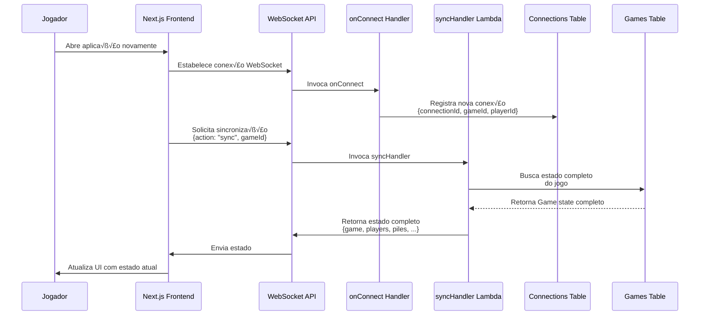
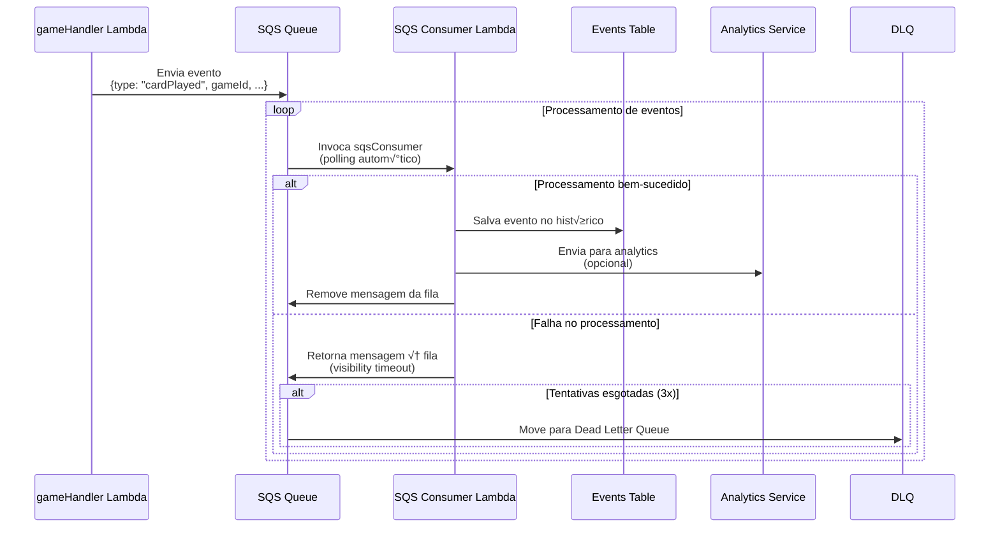
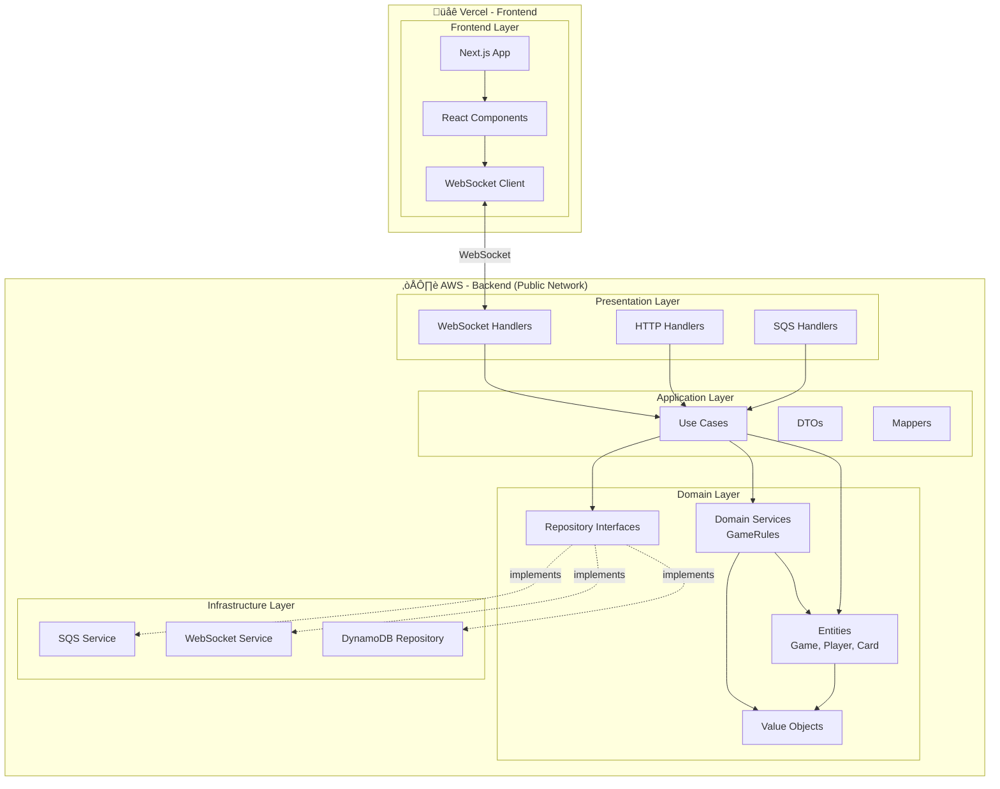
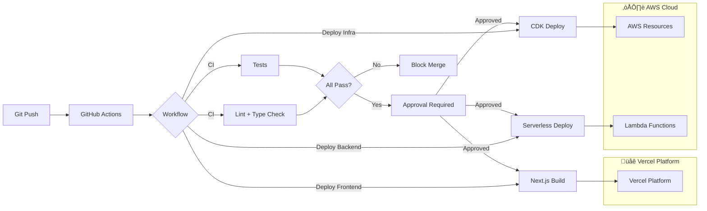

# Arquitetura do Sistema - The Game

Este documento descreve a arquitetura completa do sistema de jogo cooperativo online "The Game".

## Vis√£o Geral

O sistema é composto por três camadas principais distribuídas entre duas plataformas:

### üåê Vercel Platform
- **Frontend**: Next.js (React) - Interface do usu√°rio responsiva
  - Hospedagem e CDN global
  - Deploy autom√°tico via GitHub
  - SSL/TLS autom√°tico
  - **DNS Management**: Gerenciamento de DNS para domínios personalizados
    - Não é um serviço completo como Route53, mas permite configurar registros DNS
    - Suporta domínios comprados na Vercel ou externos
    - Configuração automática de registros A, AAAA, CNAME, MX, TXT
    - SSL autom√°tico via Let's Encrypt

### ☁️ AWS Cloud
- **Backend**: AWS Lambda + API Gateway WebSocket - Lógica de negócio e comunicação em tempo real
- **Infraestrutura**: AWS (DynamoDB, SQS, CloudFormation/CDK) - Persistência e processamento assíncrono
  - Escalabilidade autom√°tica
  - Alta disponibilidade
  - Pay-per-use
  - **Rede**: Recursos na rede p√∫blica/default (sem VPC)
    - Lambdas executam na rede p√∫blica da AWS
    - Acesso direto à internet para serviços AWS gerenciados
    - Não requer configuração de VPC, subnets ou security groups
    - Ideal para serverless (menos latência, sem cold starts de VPC)

## Diagrama de Arquitetura Geral


```mermaid
graph TB
    subgraph "Client Layer"
        Mobile[Mobile Browser]
        Desktop[Desktop Browser]
    end

    subgraph Vercel["üåê Vercel Platform"]
        subgraph "Frontend - Next.js"
            NextApp[Next.js Application]
            WSClient[WebSocket Client]
            GameUI[Game UI Components]
        end
        subgraph "DNS Management"
            CustomDomain[Custom Domain]
            DNSRecords[DNS Records<br/>A, AAAA, CNAME]
            SSLCert[SSL Certificate<br/>Auto-generated]
        end
    end

    subgraph AWS["☁️ AWS Cloud - Public Network"]
        subgraph "API Gateway"
            WSAPI[WebSocket API Gateway]
        end

        subgraph "Backend - Lambda Functions"
            OnConnect[onConnect Handler]
            OnDisconnect[onDisconnect Handler]
            GameHandler[gameHandler]
            SyncHandler[syncHandler]
            SQSConsumer[SQS Consumer]
        end

        subgraph "Data Layer"
            GamesTable[(Games Table<br/>DynamoDB)]
            ConnectionsTable[(Connections Table<br/>DynamoDB)]
            EventsTable[(Game Events Table<br/>DynamoDB)]
        end

        subgraph "Message Queue"
            SQSQueue[SQS Queue<br/>game-events]
            DLQ[Dead Letter Queue<br/>game-events-dlq]
        end
    end

    Mobile -->|HTTPS| NextApp
    Desktop -->|HTTPS| NextApp
    CustomDomain -->|DNS| NextApp
    NextApp --> WSClient
    WSClient <-->|WebSocket Connection| WSAPI
    WSAPI --> OnConnect
    WSAPI --> OnDisconnect
    WSAPI --> GameHandler
    WSAPI --> SyncHandler
    
    OnConnect --> ConnectionsTable
    OnDisconnect --> ConnectionsTable
    GameHandler --> GamesTable
    GameHandler --> SQSQueue
    SyncHandler --> GamesTable
    
    SQSQueue --> SQSConsumer
    SQSConsumer --> EventsTable
    SQSQueue -.->|failed messages| DLQ
    
    GameHandler -.->|broadcast| WSAPI
    WSAPI -.->|real-time updates| WSClient
```

## Componentes Principais

### üåê Frontend (Vercel - Next.js)

**P√°ginas:**
- `/` - Lobby: Listar e criar partidas
- `/game/[gameId]` - Tela do jogo: Visualização e interação

**Componentes:**
- `GameBoard` - Visualização das 4 pilhas (2 crescentes, 2 decrescentes)
- `PlayerHand` - Cartas do jogador atual
- `PlayersList` - Lista de jogadores conectados
- `GameStatus` - Status da partida (turno, cartas restantes)

**Serviços:**
- `WebSocketService` - Gerenciamento de conex√£o WebSocket
- `GameService` - Lógica de negócio do frontend

### ☁️ Backend (AWS Lambda)

**Handlers WebSocket:**
- `onConnect` - Registra nova conex√£o WebSocket
- `onDisconnect` - Limpa conex√£o ao desconectar
- `gameHandler` - Processa ações do jogo (jogar carta, criar partida, etc)

**Handlers HTTP:**
- `syncHandler` - Sincroniza estado quando jogador reconecta

**Handlers SQS:**
- `sqsConsumer` - Processa eventos da fila SQS

### ☁️ Infraestrutura AWS

**DynamoDB Tables:**
- `the-game-games` - Estado completo das partidas
- `the-game-connections` - Mapeamento connectionId ‚Üí gameId + playerId
- `the-game-game-events` - Histórico de eventos (opcional, para replay/debug)

**SQS Queues:**
- `the-game-game-events` - Fila principal para eventos críticos
- `the-game-game-events-dlq` - Dead Letter Queue para eventos que falharam

**API Gateway:**
- WebSocket API para comunicação em tempo real

## Fluxo de Dados

### 1. Jogador Joga uma Carta


```mermaid
sequenceDiagram
    participant Player as Jogador
    participant Frontend as Next.js Frontend
    participant WSAPI as WebSocket API
    participant Handler as gameHandler Lambda
    participant DynamoDB as Games Table
    participant SQS as SQS Queue
    participant Consumer as SQS Consumer
    participant Events as Events Table
    participant OtherPlayers as Outros Jogadores

    Player->>Frontend: Clica em carta para jogar
    Frontend->>WSAPI: Envia mensagem WebSocket<br/>{action: "playCard", card, pileId}
    WSAPI->>Handler: Invoca gameHandler
    
    Handler->>DynamoDB: Busca estado do jogo
    DynamoDB-->>Handler: Retorna Game state
    
    Handler->>Handler: Valida regra do jogo<br/>(canPlayCard)
    
    alt Carta v√°lida
        Handler->>DynamoDB: Atualiza estado<br/>(transação atômica)
        Handler->>SQS: Envia evento<br/>{type: "cardPlayed", ...}
        Handler->>WSAPI: Broadcast para todos<br/>os jogadores conectados
        WSAPI->>Frontend: Atualização em tempo real
        WSAPI->>OtherPlayers: Notifica outros jogadores
        Frontend->>Player: Atualiza UI
        
        SQS->>Consumer: Processa evento
        Consumer->>Events: Salva histórico
    else Carta inv√°lida
        Handler->>WSAPI: Retorna erro
        WSAPI->>Frontend: Exibe mensagem de erro
    end
```

### 2. Jogador Reconecta


```mermaid
sequenceDiagram
    participant Player as Jogador
    participant Frontend as Next.js Frontend
    participant WSAPI as WebSocket API
    participant OnConnect as onConnect Handler
    participant SyncHandler as syncHandler Lambda
    participant Connections as Connections Table
    participant DynamoDB as Games Table

    Player->>Frontend: Abre aplicação novamente
    Frontend->>WSAPI: Estabelece conex√£o WebSocket
    WSAPI->>OnConnect: Invoca onConnect
    
    OnConnect->>Connections: Registra nova conex√£o<br/>{connectionId, gameId, playerId}
    
    Frontend->>WSAPI: Solicita sincronização<br/>{action: "sync", gameId}
    WSAPI->>SyncHandler: Invoca syncHandler
    
    SyncHandler->>DynamoDB: Busca estado completo<br/>do jogo
    DynamoDB-->>SyncHandler: Retorna Game state completo
    
    SyncHandler->>WSAPI: Retorna estado completo<br/>{game, players, piles, ...}
    WSAPI->>Frontend: Envia estado
    Frontend->>Player: Atualiza UI com estado atual
```

### 3. Processamento Assíncrono (SQS)


```mermaid
sequenceDiagram
    participant Handler as gameHandler Lambda
    participant SQS as SQS Queue
    participant Consumer as SQS Consumer Lambda
    participant Events as Events Table
    participant Analytics as Analytics Service

    Handler->>SQS: Envia evento<br/>{type: "cardPlayed", gameId, ...}
    
    loop Processamento de eventos
        SQS->>Consumer: Invoca sqsConsumer<br/>(polling autom√°tico)
        
        alt Processamento bem-sucedido
            Consumer->>Events: Salva evento no histórico
            Consumer->>Analytics: Envia para analytics<br/>(opcional)
            Consumer->>SQS: Remove mensagem da fila
        else Falha no processamento
            Consumer->>SQS: Retorna mensagem à fila<br/>(visibility timeout)
            
            alt Tentativas esgotadas (3x)
                SQS->>DLQ: Move para Dead Letter Queue
            end
        end
    end
```

## Arquitetura de Camadas (Clean Architecture)


```mermaid
graph TB
    subgraph Vercel["üåê Vercel - Frontend"]
        subgraph "Frontend Layer"
            NextApp[Next.js App]
            ReactComponents[React Components]
            WebSocketClient[WebSocket Client]
        end
    end

    subgraph AWS["☁️ AWS - Backend (Public Network)"]
        subgraph "Presentation Layer"
            WebSocketHandlers[WebSocket Handlers]
            HTTPHandlers[HTTP Handlers]
            SQSHandlers[SQS Handlers]
        end

        subgraph "Application Layer"
            UseCases[Use Cases]
            DTOs[DTOs]
            Mappers[Mappers]
        end

        subgraph "Domain Layer"
            Entities[Entities<br/>Game, Player, Card]
            ValueObjects[Value Objects]
            DomainServices[Domain Services<br/>GameRules]
            Repositories[Repository Interfaces]
        end

        subgraph "Infrastructure Layer"
            DynamoRepo[DynamoDB Repository]
            WebSocketService[WebSocket Service]
            SQSService[SQS Service]
        end
    end

    NextApp --> ReactComponents
    ReactComponents --> WebSocketClient
    WebSocketClient <-->|WebSocket| WebSocketHandlers

    WebSocketHandlers --> UseCases
    HTTPHandlers --> UseCases
    SQSHandlers --> UseCases
    
    UseCases --> Entities
    UseCases --> DomainServices
    UseCases --> Repositories
    
    Repositories -.->|implements| DynamoRepo
    Repositories -.->|implements| WebSocketService
    Repositories -.->|implements| SQSService
    
    DomainServices --> Entities
    DomainServices --> ValueObjects
    Entities --> ValueObjects
```

## Modelo de Dados DynamoDB

### Tabela: `the-game-games`

**Partition Key:** `gameId` (String)

**Atributos:**
```typescript
{
  gameId: string;
  players: Player[];           // Array de jogadores
  piles: {                     // 4 pilhas do jogo
    ascending1: Card[];
    ascending2: Card[];
    descending1: Card[];
    descending2: Card[];
  };
  deck: Card[];                // Baralho restante
  discardPile: Card[];         // Cartas descartadas
  currentTurn: string;         // playerId do jogador atual
  status: 'waiting' | 'playing' | 'finished';
  winner: 'players' | 'game' | null;
  createdAt: number;           // Timestamp
  updatedAt: number;           // Timestamp
  ttl: number;                 // Time to Live (auto-delete após X dias)
}
```

### Tabela: `the-game-connections`

**Partition Key:** `connectionId` (String)

**Atributos:**
```typescript
{
  connectionId: string;        // WebSocket connection ID
  gameId: string;             // ID da partida
  playerId: string;           // ID do jogador
  connectedAt: number;        // Timestamp
  lastActivity: number;       // Timestamp da √∫ltima atividade
}
```

### Tabela: `the-game-game-events`

**Partition Key:** `gameId` (String)  
**Sort Key:** `timestamp` (Number)

**Atributos:**
```typescript
{
  gameId: string;
  timestamp: number;           // Timestamp do evento
  eventType: 'cardPlayed' | 'gameCreated' | 'gameFinished' | ...;
  eventData: {
    playerId: string;
    card: Card;
    pileId: string;
    // ... outros dados específicos do evento
  };
}
```

## Segurança

### Autenticação e Autorização

- **OIDC com IAM Roles**: GitHub Actions usa OIDC para autenticação segura na AWS
- **Validação de Ações**: Cada ação do jogador é validada (não pode jogar carta do outro)
- **Rate Limiting**: Proteção contra abuso nas Lambdas
- **CORS**: Configurado no API Gateway

### Gest√£o de Secrets

- **GitHub Secrets**: Credenciais AWS (Role ARN, Region)
- **AWS Secrets Manager**: Secrets da aplicação (se necessário)
- **Nunca commitadas**: Todos os secrets ficam em vari√°veis de ambiente

## CI/CD Pipeline


```mermaid
graph LR
    A[Git Push] --> B[GitHub Actions]
    B --> C{Workflow}
    
    C -->|CI| D[Lint + Type Check]
    C -->|CI| E[Tests]
    
    C -->|Deploy Infra| F[CDK Deploy]
    F --> G[AWS Resources]
    
    C -->|Deploy Backend| H[Serverless Deploy]
    H --> I[Lambda Functions]
    
    C -->|Deploy Frontend| J[Next.js Build]
    J --> K[Vercel Platform]
    
    D --> L{All Pass?}
    E --> L
    L -->|Yes| M[Approval Required]
    L -->|No| N[Block Merge]
    
    M -->|Approved| F
    M -->|Approved| H
    M -->|Approved| J
    
    subgraph AWS["☁️ AWS Cloud"]
        G
        I
    end
    
    subgraph Vercel["üåê Vercel Platform"]
        K
    end
```

## Escalabilidade

### Horizontal Scaling

- **Lambda**: Escala automaticamente baseado em requisições
- **DynamoDB**: On-demand billing, escala automaticamente
- **SQS**: Processa mensagens em paralelo
- **API Gateway WebSocket**: Gerencia milhares de conexões simultâneas

### Limites e Considerações

- **WebSocket Connections**: Até 100.000 conexões simultâneas por API Gateway
- **Lambda Concurrency**: Configurável por função
- **DynamoDB Throughput**: On-demand mode sem limites de throughput
- **SQS Throughput**: Até 3.000 mensagens/segundo por fila

## Monitoramento e Observabilidade

### Métricas AWS CloudWatch

- **Lambda**: Invocações, erros, duração, throttles
- **DynamoDB**: Read/Write capacity, throttles, latência
- **SQS**: Mensagens enviadas/recebidas, mensagens na DLQ
- **API Gateway**: Contagem de conexões, mensagens, latência

### Logs

- **Lambda Logs**: CloudWatch Logs para cada função
- **Application Logs**: Estruturados em JSON para f√°cil parsing
- **Error Tracking**: Integração com CloudWatch Alarms

## Arquitetura de Rede

A aplicação **não utiliza VPC**. Todos os recursos executam na **rede pública/default** da AWS:

- ✅ **Lambda Functions**: Rede pública (menor latência, sem cold starts de VPC)
- ✅ **DynamoDB**: Acessível via endpoint público (protegido por IAM)
- ✅ **SQS**: Acessível via endpoint público (protegido por IAM)
- ✅ **API Gateway**: Publicamente acessível (necessário para WebSocket)

**Vantagens**:
- Menor latência e cold starts mais rápidos
- Menor custo (sem NAT Gateway)
- Simplicidade de configuração
- Segurança via IAM é suficiente

Para detalhes completos, consulte [`NETWORK_ARCHITECTURE.md`](./NETWORK_ARCHITECTURE.md).

## Próximos Passos

1. ‚úÖ Infraestrutura AWS criada (DynamoDB, SQS, WebSocket API)
2. ‚è≥ Implementar handlers Lambda (onConnect, onDisconnect, gameHandler)
3. ⏳ Implementar lógica de negócio (GameRules, GameService)
4. ‚è≥ Implementar frontend (componentes React, WebSocket client)
5. ⏳ Implementar testes (TDD para regras de negócio)
6. ‚è≥ Configurar monitoramento e alertas

## Referências

- [AWS API Gateway WebSocket](https://docs.aws.amazon.com/apigateway/latest/developerguide/apigateway-websocket-api.html)
- [AWS Lambda](https://docs.aws.amazon.com/lambda/)
- [AWS DynamoDB](https://docs.aws.amazon.com/dynamodb/)
- [AWS SQS](https://docs.aws.amazon.com/sqs/)
- [Next.js](https://nextjs.org/docs)
- [Clean Architecture](https://blog.cleancoder.com/uncle-bob/2012/08/13/the-clean-architecture.html)
- [AWS Lambda in VPC](https://docs.aws.amazon.com/lambda/latest/dg/configuration-vpc.html)

