# Diagrama de Sequência - Criar Partida até Exibir Tabuleiro

Este diagrama mostra o fluxo completo desde o clique no botão "Criar Partida" até o tabuleiro ser exibido na tela.

```mermaid
sequenceDiagram
    actor Usuário
    participant Frontend as Frontend<br/>(Next.js)
    participant API as API Gateway<br/>(HTTP)
    participant LambdaHTTP as Lambda<br/>(createGame)
    participant DynamoDB as DynamoDB<br/>(Games Table)
    participant APIWS as API Gateway<br/>(WebSocket)
    participant LambdaWS as Lambda<br/>(onConnect)
    participant LambdaGame as Lambda<br/>(gameHandler)
    participant Connections as DynamoDB<br/>(Connections Table)

    Note over Usuário,Connections: 1. CRIAR PARTIDA (HTTP)
    
    Usuário->>Frontend: Clica em "Criar Partida"
    Frontend->>Frontend: Valida playerName
    Frontend->>API: POST /api/games<br/>{playerName: "João"}
    
    API->>LambdaHTTP: Invoke createGame handler
    LambdaHTTP->>LambdaHTTP: Valida request body
    LambdaHTTP->>LambdaHTTP: CreateGameUseCase.execute()
    LambdaHTTP->>LambdaHTTP: GameInitializer.createGame()
    LambdaHTTP->>LambdaHTTP: Gera gameId (6 chars)
    LambdaHTTP->>LambdaHTTP: Cria Player com cartas
    LambdaHTTP->>LambdaHTTP: Embaralha deck
    LambdaHTTP->>DynamoDB: PutItem(gameId, game)
    
    DynamoDB-->>LambdaHTTP: Game salvo
    LambdaHTTP-->>API: 201 Created<br/>{gameId, playerId, game}
    
    API-->>Frontend: Response JSON
    Frontend->>Frontend: sessionStorage.setItem<br/>('playerId', 'gameId')
    Frontend->>Frontend: window.location.href<br/>= /game/{gameId}
    
    Note over Usuário,Connections: 2. CARREGAR PÁGINA DO JOGO
    
    Frontend->>Frontend: Carrega GamePage component
    Frontend->>Frontend: Lê playerId do<br/>sessionStorage/URL
    Frontend->>Frontend: Inicializa GameWebSocket
    
    Note over Usuário,Connections: 3. OBTER URL DO WEBSOCKET
    
    Frontend->>API: GET /api/websocket-url<br/>?gameId=X&playerId=Y
    API->>LambdaHTTP: Invoke getWebSocketUrl handler
    LambdaHTTP->>DynamoDB: GetItem(gameId)
    DynamoDB-->>LambdaHTTP: Game encontrado
    LambdaHTTP->>LambdaHTTP: Valida playerId no jogo
    LambdaHTTP->>LambdaHTTP: AuthService.createToken()
    LambdaHTTP->>LambdaHTTP: Gera WebSocket URL<br/>com token na query string
    LambdaHTTP-->>API: 200 OK<br/>{wsUrl: "wss://...?token=..."}
    API-->>Frontend: Response JSON
    
    Note over Usuário,Connections: 4. CONECTAR WEBSOCKET
    
    Frontend->>Frontend: new WebSocket(wsUrl)
    Frontend->>APIWS: WebSocket Connect<br/>(com token na query string)
    
    APIWS->>LambdaWS: Invoke $connect handler
    LambdaWS->>LambdaWS: Extrai token da query string
    LambdaWS->>LambdaWS: AuthService.validateToken()
    LambdaWS->>LambdaWS: Extrai gameId e playerId
    LambdaWS->>DynamoDB: GetItem(gameId)
    DynamoDB-->>LambdaWS: Game encontrado
    LambdaWS->>LambdaWS: Valida playerId no jogo
    LambdaWS->>Connections: PutItem(connectionId,<br/>gameId, playerId)
    Connections-->>LambdaWS: Conexão salva
    
    LambdaWS-->>APIWS: 200 OK (conexão estabelecida)
    APIWS-->>Frontend: WebSocket OPEN
    
    Note over Usuário,Connections: 5. ENVIAR ESTADO INICIAL (ASSÍNCRONO)
    
    LambdaWS->>LambdaWS: Prepara gameStateMessage<br/>(serializa Game)
    LambdaWS->>LambdaWS: WebSocketService<br/>.sendToConnection()
    LambdaWS->>APIWS: PostToConnection<br/>(connectionId, message)
    APIWS-->>Frontend: WebSocket Message<br/>{type: "gameState", game: {...}}
    
    Note over Usuário,Connections: 6. SOLICITAR SINCRONIZAÇÃO (FALLBACK)
    
    Frontend->>Frontend: setTimeout(500ms)<br/>Solicita sync
    Frontend->>APIWS: WebSocket Send<br/>{action: "sync", gameId: "X"}
    
    APIWS->>LambdaGame: Invoke $default handler<br/>(gameHandler)
    LambdaGame->>LambdaGame: Parse message body
    LambdaGame->>LambdaGame: Identifica action: "sync"
    LambdaGame->>Connections: GetItem(connectionId)
    Connections-->>LambdaGame: Connection encontrada
    LambdaGame->>LambdaGame: SyncGameUseCase.execute()
    LambdaGame->>DynamoDB: GetItem(gameId)
    DynamoDB-->>LambdaGame: Game completo
    LambdaGame->>LambdaGame: Serializa Game para JSON
    LambdaGame->>LambdaGame: WebSocketService<br/>.sendToConnection()
    LambdaGame->>APIWS: PostToConnection<br/>(connectionId, message)
    APIWS-->>Frontend: WebSocket Message<br/>{type: "gameState", game: {...}}
    
    Note over Usuário,Connections: 7. RENDERIZAR TABULEIRO
    
    Frontend->>Frontend: onMessage recebe<br/>gameState
    Frontend->>Frontend: setGameState(game)
    Frontend->>Frontend: React re-render
    Frontend->>Frontend: Renderiza GameBoard<br/>com pilhas e cartas
    Frontend->>Frontend: Renderiza PlayerHand<br/>com cartas do jogador
    Frontend->>Frontend: Renderiza PlayersList<br/>com jogadores conectados
    Frontend-->>Usuário: Tabuleiro exibido na tela
```

## Componentes Principais

### 1. Criar Partida (HTTP)
- **Frontend**: Valida entrada e faz POST para `/api/games`
- **Lambda createGame**: Cria jogo, embaralha cartas, distribui mão inicial
- **DynamoDB**: Salva o jogo com status "waiting"
- **Resposta**: Retorna `gameId`, `playerId` e objeto `game` completo

### 2. Carregar Página do Jogo
- **Frontend**: Redireciona para `/game/{gameId}`
- Lê `playerId` do `sessionStorage` ou URL
- Inicializa componente `GamePage` e `GameWebSocket`

### 3. Obter URL do WebSocket
- **Frontend**: Faz GET para `/api/websocket-url` com `gameId` e `playerId`
- **Lambda getWebSocketUrl**: Valida jogo e jogador, gera token JWT
- **Resposta**: Retorna URL WebSocket com token na query string

### 4. Conectar WebSocket
- **Frontend**: Cria nova conexão WebSocket com URL autenticada
- **Lambda onConnect**: Valida token, verifica jogo/jogador, salva conexão
- **DynamoDB Connections**: Armazena mapeamento `connectionId → gameId + playerId`
- **Resposta**: Conexão estabelecida (status 200)

### 5. Enviar Estado Inicial (Assíncrono)
- **Lambda onConnect**: Após salvar conexão, envia estado do jogo assincronamente
- Serializa objeto `Game` para JSON (converte `Date` para ISO string)
- Envia via `WebSocketService.sendToConnection()`
- **Frontend**: Recebe mensagem `{type: "gameState", game: {...}}`

### 6. Solicitar Sincronização (Fallback)
- **Frontend**: Se não receber estado em 500ms, solicita explicitamente
- Envia mensagem `{action: "sync", gameId: "X"}` via WebSocket
- **Lambda gameHandler**: Processa ação "sync", busca jogo, envia estado
- **Frontend**: Recebe estado e atualiza UI

### 7. Renderizar Tabuleiro
- **Frontend**: Atualiza estado React com `setGameState(game)`
- Componentes re-renderizam:
  - `GameBoard`: Mostra 4 pilhas (ascending1, ascending2, descending1, descending2)
  - `PlayerHand`: Mostra cartas do jogador atual
  - `PlayersList`: Mostra lista de jogadores conectados
- **Usuário**: Vê tabuleiro completo na tela

## Fluxos de Erro

### Erro ao Criar Partida
- Se validação falhar → 400 Bad Request
- Se DynamoDB falhar → 500 Internal Server Error
- Frontend exibe mensagem de erro

### Erro ao Obter WebSocket URL
- Se jogo não existir → 404 Not Found
- Se jogador não estiver no jogo → 403 Forbidden
- Frontend exibe erro e não conecta

### Erro ao Conectar WebSocket
- Se token inválido → 401 Unauthorized (conexão fechada)
- Se jogo não existir → 403 Forbidden (conexão fechada)
- Se jogador não estiver no jogo → 403 Forbidden (conexão fechada)
- Frontend detecta fechamento e exibe erro

### Erro ao Receber Estado
- Se mensagem inicial não chegar → Frontend solicita sync após 500ms
- Se sync falhar → Retry automático (até 3 tentativas)
- Se todas falharem → Botão "Tentar Novamente" aparece

## Tempos Estimados

- **Criar Partida**: ~200-500ms (HTTP + DynamoDB)
- **Obter WebSocket URL**: ~100-300ms (HTTP + DynamoDB)
- **Conectar WebSocket**: ~100-200ms (WebSocket handshake)
- **Receber Estado Inicial**: ~50-150ms (assíncrono após conexão)
- **Solicitar Sync (fallback)**: ~100-300ms (se necessário)
- **Renderizar Tabuleiro**: ~16-50ms (React render)

**Total**: ~560ms - 1.5s (sem fallback) ou ~660ms - 1.8s (com fallback)

## Notas Técnicas

1. **Estado Inicial Assíncrono**: O `onConnect` retorna 200 imediatamente e envia estado depois, para evitar timeout do API Gateway
2. **Fallback de Sync**: Frontend solicita sync explicitamente se não receber estado em 500ms
3. **Retry Automático**: Se sync falhar, frontend tenta novamente até 3 vezes
4. **Serialização**: Objetos `Date` são convertidos para ISO strings antes de enviar via WebSocket
5. **Conexão Persistente**: Conexão WebSocket permanece aberta para receber atualizações em tempo real

